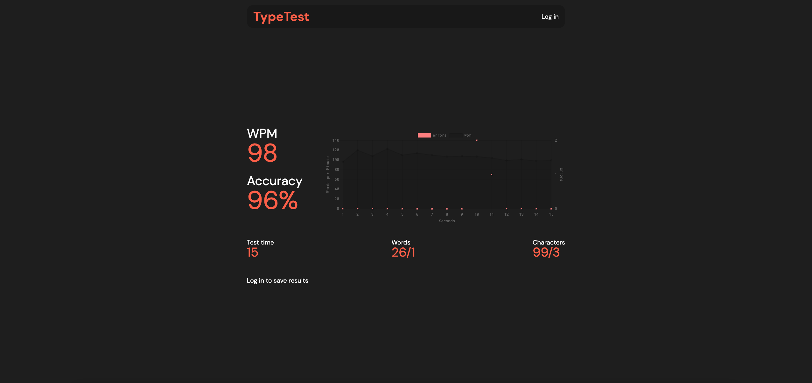

<h1 align="center">Welcome to TypeTest!</h1>

The best typing analysis tool

# Current Features

-   15, 30, and 60 second WPM tests
-   Deep analysis:
    -   WPM calculation
    -   Accuracy calculation
    -   Correct/incorrect words ratio
    -   Correct/incorrect characters ratio
    -   WPM and error count interactive chart
    -   User account system and leaderboard

Example:

_Please note that this app is not available to the public yet!_

# Features in Development

-   Adding custom test times
-   Theme switcher
-   Gross WPM calculation
-   More languages (currently have english and spanish)
